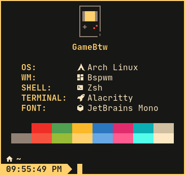

<h1 align="center"><b>████:</b>&nbsp;&nbsp;<i>Bfetch</i></h1>
<p align="center">Fetch that <i>SuperB</i></p>

<p align="center">
    
</p>

## About
**Bfetch** is a command-line system information tool written in `sh`. <br>
It displays any information about any things you want.

> "This is the most **flexible** fetch ever existed." <br>
> *\- Someone*

> "Bfetch is so **minimum** that it min itself out of existence." <br>
> *\- Also someone*

###### **NOTE:** Bfetch is still in beta.

### Story
I often open terminal in a busy monitor. For a guy who put fetch tool at terminal startup, the fetch doesn't have much space to display make the fetch look somewhat odd... So i try other fetch tool:
* [**Neofetch**](https://github.com/dylanaraps/neofetch): too much.
* [**Pfetch**](https://github.com/dylanaraps/pfetch): too little.
* [**Ufetch**](https://gitlab.com/jschx/ufetch): too weak.

All cool but i still doesn't satisfy with any of it :(. So i start with [Ufetch](https://gitlab.com/jschx/ufetch) and looking around [Pfetch](https://github.com/dylanaraps/pfetch) source code... After 2 week i finally finished this fetch, this super flexible fetch.

### Features
* Super **minimum** with only 200 line of `sh`.
* Super **flexible**:
  * **Align/shift** contents based on terminal size.
  * **Hide** picture and color-line if terminal is too small.
* Super **Customizable**:
  * Bfetch can display anything you want, however you want.
  * You can put custom ascii-art with `.bfetch` file format.
  * You can put info-line that show custom command output.
* Have two layouts:

```
┌──────────┬──────────┐
│ Layout 1 │ Layout 2 │
├──────────┼──────────┤
│    ▓▓    │ ▐▓▌info  │
│   info   │    info  │
│   info   │   ▀▀▀▀   │
│  ▀▀▀▀▀▀  │          │
└──────────┴──────────┘
```

## Contents
* [About](#about)
  * [Story](#story)
  * [Features](#features)
* [Contents](#contents)
* [Setup](#setup)
  * [Requirements](#requirements)
  * [Installation](#installation)
* [Usage](#usage)
  * [Configuration](#configuration)
    * [Advanced Infos](#advanced-infos)
    * [Picture](#picture)
      * [Ascii](#ascii)
      * [Image](#image)
* [Q&A](#q&a)
* [TODO/FIXME](#todo%2Ffixme)
* [Credit](#credit)

## Setup
### Requirements
* A linux system.

### Installation
Git clone the repo:
```sh
git clone https://github.com/SakashiNNB/bfetch "$HOME/.local/share/bfetch"
```

Link the file:
```sh
ln -sf "$HOME/.local/share/bfetch/bfetch" "$HOME/.local/bin/bfetch"
```

Done :).

## Usage
Type the command:
```sh
bfetch
```

Hit enter and take a look:
```
┌──────────────────────────────────┐
│                /\                │
│               /  \               │
│              /\   \              │
│             /  __  \             │
│            /  (  )  \            │
│           / __|  |__\\           │
│          /.`        `.\          │
│                                  │
│     OS:        Arch Linux        │
│     WM:        Bspwm             │
│     SHELL:     Zsh               │
│     TERMINAL:  Alacritty         │
│     FONT:      JetBrains Mono    │
│                                  │
│ ░░░░▓▓▓▓▒▒▒▒▓▓▓▓▒▒▒▒▓▓▓▓▒▒▒▒████ │
│     ▒▒▒▒░░░░▒▒▒▒░░░░▒▒▒▒░░░░▓▓▓▓ │
│ ~ >                              │
└──────────────────────────────────┘
```

###### **NOTE:** This ascii-art is taking from [Ufetch](https://gitlab.com/jschx/ufetch).

### Configuration
Bfetch is configured through environment variables.

```sh
# Terminal size
export BF_prompt_height="1"  # Needed if you use custom prompt like powerlevel10k.

# Infos
export BF_info0="$(tput bold)$(tput setaf 6)OS:        $(tput sgr0)Arch Linux"
export BF_info1="$(tput bold)$(tput setaf 6)WM:        $(tput sgr0)Bspwm"
export BF_info2="$(tput bold)$(tput setaf 6)SHELL:     $(tput sgr0)Zsh"
export BF_info3="$(tput bold)$(tput setaf 6)TERMINAL:  $(tput sgr0)Alacritty"
export BF_info4="$(tput bold)$(tput setaf 6)FONT:      $(tput sgr0)JetBrains Mono"
# export BF_info...="..."  # Add how much infos as you want.
# For more advanced infos check down below...
export BF_info_size="25"  # Length of the longest info, needed for alignment.

# Picture
export BF_pic="$HOME/.local/share/fetchs/unicode/archlinux.bfetch"  # Path to ascii file.

# Color-line
export BF_color_size="4"  # Size of a color cell.

# White-spaces
export BF_hsep_size="1"  # Size of horizontal separate.
export BF_vsep_size="4"  # Size of vertical separate.

# Layout & other
export BF_layout=""  # Use only one layout, leave it empty to auto choose layout.
export BF_layout2=""  # Set alignment for layout 2, leave it empty to center align.
export BF_color_on_info="false"  # Set color-line as a part of infos.
export BF_cmd="echo 'Term too small'"  # Command run if terminal is too small.
```

#### Advanced infos
```sh
export BF_info0="$(tput bold)$(tput setaf 6)$USER$(tput sgr0)@$(tput bold)$(tput setaf 6)$(hostname)"
export BF_info1="$(tput sgr0)----------------------"
export BF_info2="$(tput bold)$(tput setaf 6)OS:        $(tput sgr0)$(uname -sm)"
export BF_info3="$(tput bold)$(tput setaf 6)Kernel:    $(tput sgr0)$(uname -r)"
export BF_info4="$(tput bold)$(tput setaf 6)Uptime:    $(tput sgr0)$(uptime -p | sed -e 's/up //g' -e 's/minutes/mins/g')"
export BF_info5="$(tput bold)$(tput setaf 6)Shell:     $(tput sgr0)$(printf "$SHELL" | sed -e 's/\/bin\///g')"
export BF_info6="$(tput bold)$(tput setaf 6)Terminal:  $(tput sgr0)$(ps -o comm= -p "$(($(ps -o ppid= -p "$(($(ps -o sid= -p "$$")))")))")"
export BF_info7=" "
export BF_info8="$(tput sgr0) · $(tput setaf 1)▲$(tput sgr0) · $(tput setaf 3)▼$(tput sgr0) · $(tput setaf 2)▲$(tput sgr0) · $(tput setaf 4)▼$(tput sgr0) · $(tput setaf 6)▲$(tput sgr0) · "
export BF_info9=" "
export BF_info10="$(tput bold)$(tput setaf 6)Location:  $(tput sgr0)$(curl --silent ifconfig.co/city)/$(curl --silent ifconfig.co/country)"
export BF_info11="$(tput bold)$(tput setaf 6)IP:        $(tput sgr0)$(curl --silent ifconfig.me)"
export BF_info12="$(tput bold)$(tput setaf 6)CORONA:    $(tput sgr0)$(curl --silent https://corona-stats.online/ | grep "World" | grep "," | sed -e 's/│/|/g' -e 's/ //g' | cut -f 8 -d "|")"
```

###### More info will come through plug-ins.

#### Picture
##### Ascii
Bfetch use `.bfetch` format as an ascii-art file. <br>
This is how `.bfetch` work:

```
┌──────┬──────────────────────────────────────────────────────────────────────────────────────────────────────┐
│ Line │ archlinux.bfetch                                                                                     │
├──────┼──────────────────────────────────────────────────────────────────────────────────────────────────────┤
│    1 │ 12 7 14   # pic-start; pic-height; pic-width                                                         │
│    2 │ 21 19 37  # pic-big-start; pic-big-height; pic-big-width                                             │
│    3 │ 6 . 4 2   # label-color; text-color; 1-color; 2-color                                                │
│    4 │                                                                                                      │
│    5 │ ########[ Description ]########                                                                      │
│    6 │ Description:  This ascii-art is port from Neofetch and Ufetch:                                       │
│    7 │                 ├─ Small picture:  https://gitlab.com/jschx/ufetch/-/blob/master/ufetch-arch#L66     │
│    8 │                 └─ Big picture:    https://github.com/dylanaraps/neofetch/blob/master/neofetch#L5723 │
│    9 │ Author:       Dylan                                                                                  │
│   10 │                 └─ https://github.com/dylanaraps                                                     │
│   11 │               Jschx                                                                                  │
│   12 │                 └─ https://gitlab.com/jschx                                                          │
│   13 │ Port by:      Sakashi_NNB                                                                            │
│   14 │                 └─ https://github.com/SakashiNNB                                                     │
│   15 │ License:      GPLv3                                                                                  │
│   16 │                                                                                                      │
│   17 │                                                                                                      │
│   18 │ * Note: This part will not be print out.                                                             │
│   19 │                                                                                                      │
│   20 │ #######[ Small picture ]#######                                                                      │
│   21 │ $(tput setaf 6)      /\\      $(tput sgr0)                                                           │
│   22 │ $(tput setaf 6)     /  \\     $(tput sgr0)                                                           │
│   23 │ $(tput setaf 6)    /\\   \\    $(tput sgr0)                                                          │
│   24 │ $(tput setaf 6)   /  __  \\   $(tput sgr0)                                                           │
│   25 │ $(tput setaf 6)  /  (  )  \\  $(tput sgr0)                                                           │
│   26 │ $(tput setaf 6) / __|  |__\\\\ $(tput sgr0)                                                          │
│   27 │ $(tput setaf 6)/.\`        \`.\\$(tput sgr0)                                                         │
│   28 │                                                                                                      │
│   29 │ ########[ Big picture ]########                                                                      │
│   30 │ $(tput setaf 6)                  -`                 $(tput sgr0)                                     │
│   31 │ $(tput setaf 6)                 .o+`                $(tput sgr0)                                     │
│   32 │ $(tput setaf 6)                `ooo/                $(tput sgr0)                                     │
│   33 │ $(tput setaf 6)               `+oooo:               $(tput sgr0)                                     │
│   34 │ $(tput setaf 6)              `+oooooo:              $(tput sgr0)                                     │
│   35 │ $(tput setaf 6)              -+oooooo+:             $(tput sgr0)                                     │
│   36 │ $(tput setaf 6)            `/:-:++oooo+:            $(tput sgr0)                                     │
│   37 │ $(tput setaf 6)           `/++++/+++++++:           $(tput sgr0)                                     │
│   38 │ $(tput setaf 6)          `/++++++++++++++:          $(tput sgr0)                                     │
│   39 │ $(tput setaf 6)         `/+++ooooooooooooo/`        $(tput sgr0)                                     │
│   40 │ $(tput setaf 6)        ./ooosssso++osssssso+`       $(tput sgr0)                                     │
│   41 │ $(tput setaf 6)       .oossssso-````/ossssss+`      $(tput sgr0)                                     │
│   42 │ $(tput setaf 6)      -osssssso.      :ssssssso.     $(tput sgr0)                                     │
│   43 │ $(tput setaf 6)     :osssssss/        osssso+++.    $(tput sgr0)                                     │
│   44 │ $(tput setaf 6)    /ossssssss/        +ssssooo/-    $(tput sgr0)                                     │
│   45 │ $(tput setaf 6)  `/ossssso+/:-        -:/+osssso+-  $(tput sgr0)                                     │
│   46 │ $(tput setaf 6) `+sso+:-`                 `.-/+oso: $(tput sgr0)                                     │
│   47 │ $(tput setaf 6)`++:.                           `-/+/$(tput sgr0)                                     │
│   48 │ $(tput setaf 6).`                                 `/$(tput sgr0)                                     │
│   49 │                                                                                                      │
└──────┴──────────────────────────────────────────────────────────────────────────────────────────────────────┘
```

##### Image
\#TODO

## TODO/FIXME
* [ ] Option to align layout 1 to the left.
* [ ] Have better default infos.
* [ ] Port more ascii-arts.
* [ ] Suport big picture for ascii.
* [ ] Suport main color from `.bfetch` file.
* [ ] Add Plug-ins.
* [ ] Support image.

## Q&A
\#TODO

## Credit
Special thanks to:
* [**Neofetch**](https://github.com/dylanaraps/neofetch) by [Dylan](https://github.com/dylanaraps)
* [**Pfetch**](https://github.com/dylanaraps/pfetch) also by [Dylan](https://github.com/dylanaraps)
* [**Ufetch**](https://gitlab.com/jschx/ufetch) by [Jschx](https://gitlab.com/jschx)
* [**Writing a TUI in BASH**](https://github.com/dylanaraps/writing-a-tui-in-bash) also by [Dylan](https://github.com/dylanaraps)

###### **NOTE:** Bfetch shares zero code with Neofetch, Pfetch or Ufetch
